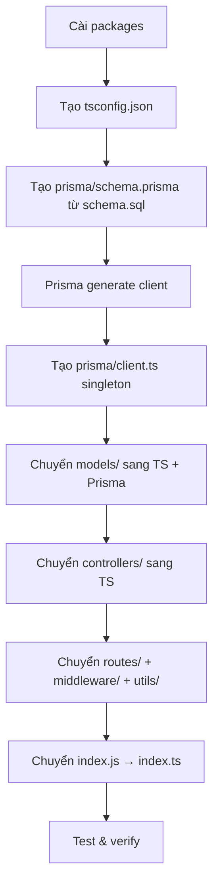

# Migrate Server: JavaScript → TypeScript + Prisma ORM

## Tổng quan

Hiện tại server đang dùng:
- **JavaScript** thuần với CommonJS (`require/module.exports`)
- **mysql2/promise** để query SQL thủ công
- Kiến trúc: `routes → controllers → models` (models chứa raw SQL)

Mục tiêu migrate sang:
- **TypeScript** với ESM/CommonJS (chọn CommonJS cho tương thích)
- **Prisma ORM** thay thế toàn bộ raw SQL trong các model
- Giữ nguyên kiến trúc `routes → controllers → models` (hoặc dùng Prisma Client trực tiếp trong controller)

---

## User Review Required

> [!IMPORTANT]
> **Chiến lược migrate model**: Có 2 cách tiếp cận:
> 1. **Giữ lại tầng `models/`** — Các model file chuyển sang `.ts`, bên trong dùng Prisma Client thay vì raw SQL → Ít thay đổi nhất, dễ kiểm soát
> 2. **Bỏ tầng `models/`** — Controllers gọi Prisma Client trực tiếp → Code gọn hơn nhưng thay đổi nhiều
>
> **Khuyến nghị**: Giữ lại tầng `models/` (option 1) để dễ review từng file.

> [!IMPORTANT]
> **Migrate toàn bộ hay từng phần?**
> - **Toàn bộ cùng lúc** — Nhanh nhưng rủi ro cao hơn
> - **Từng module** — An toàn hơn, có thể chạy song song JS/TS trong quá trình chuyển đổi
>
> **Khuyến nghị**: Migrate toàn bộ cùng một lúc vì dự án không quá lớn (~10 model files).

> [!WARNING]
> **Prisma với MySQL**: Prisma sẽ introspect (đọc) schema từ database hiện có hoặc dùng `schema.prisma` để migration. Vì đã có `schema.sql`, ta sẽ dùng **Prisma introspect** từ database hoặc **viết tay `schema.prisma`** từ file SQL.
>
> **Khuyến nghị**: Viết tay `schema.prisma` từ `database/schema.sql` vì nó rõ ràng và chính xác hơn.

---

## Open Questions

> [!IMPORTANT]
> **Database có đang chạy không?** Nếu database đã có dữ liệu và đang hoạt động, ta sẽ dùng `prisma db pull` (introspect) để generate `schema.prisma`. Nếu chưa, ta sẽ viết schema thủ công và dùng `prisma migrate dev`.

---

## Proposed Changes

### 1. Cài đặt Dependencies

#### [MODIFY] [package.json](file:///d:/GitHub/clothing-shop-project/server/package.json)
- Thêm `typescript`, `ts-node`, `@types/*` vào `devDependencies`
- Thêm `prisma` vào `devDependencies`
- Thêm `@prisma/client` vào `dependencies`
- Thêm script `build`, `dev` dùng `ts-node` hoặc `tsx`
- Bỏ `mysql2` (hoặc giữ lại tạm nếu migrate từng phần)

**Packages thêm vào:**
```
devDependencies:
  typescript
  ts-node (hoặc tsx - nhanh hơn)
  @types/node
  @types/express
  @types/cors
  @types/bcryptjs
  @types/jsonwebtoken
  @types/multer
  @types/nodemailer
  prisma

dependencies:
  @prisma/client
```

---

### 2. Cấu hình TypeScript

#### [NEW] tsconfig.json
```json
{
  "compilerOptions": {
    "target": "ES2020",
    "module": "commonjs",
    "lib": ["ES2020"],
    "outDir": "./dist",
    "rootDir": "./",
    "strict": true,
    "esModuleInterop": true,
    "skipLibCheck": true,
    "forceConsistentCasingInFileNames": true,
    "resolveJsonModule": true
  },
  "include": ["src/**/*", "index.ts"],
  "exclude": ["node_modules", "dist"]
}
```

---

### 3. Prisma Schema

#### [NEW] prisma/schema.prisma
Chuyển đổi toàn bộ `database/schema.sql` → Prisma schema. Bao gồm tất cả các tables:
- `memberships`, `users`, `otps`
- `categories`, `products`, `product_colors`, `product_sizes`
- `banners`, `sales`, `product_sales`, `sale_categories`
- `vouchers`, `product_vouchers`, `voucher_categories`
- `buy_x_get_y_promotions`
- `orders`, `order_items`, `promotion_usage_history`, `return_requests`, `revenues`
- `user_product_interaction`

#### [NEW] prisma/client.ts
Singleton Prisma Client để tái sử dụng toàn app.

---

### 4. Chuyển đổi Source Files (JS → TS)

**Cấu trúc thư mục sau migrate:**
```
server/
├── index.ts                    (từ index.js)
├── prisma/
│   ├── schema.prisma
│   └── client.ts
├── src/
│   ├── db.ts                   (giữ lại hoặc xóa - thay bằng prisma/client.ts)
│   ├── controllers/
│   │   ├── adminController.ts
│   │   ├── authController.ts
│   │   ├── categoryController.ts
│   │   ├── chatController.ts
│   │   ├── inventoryController.ts
│   │   ├── membershipController.ts
│   │   ├── orderController.ts
│   │   ├── productController.ts
│   │   ├── productDetailController.ts
│   │   ├── promotionController.ts
│   │   ├── saleController.ts
│   │   └── voucherController.ts
│   ├── models/
│   │   ├── adminModel.ts       (raw SQL → Prisma queries)
│   │   ├── categoryModel.ts
│   │   ├── membershipModel.ts
│   │   ├── orderModel.ts
│   │   ├── productDetailModel.ts
│   │   ├── productModel.ts
│   │   ├── promotionModel.ts
│   │   ├── saleModel.ts
│   │   ├── userModel.ts
│   │   └── voucherModel.ts
│   ├── routes/
│   │   └── *.ts (đổi extension)
│   ├── middleware/
│   │   └── *.ts
│   ├── utils/
│   │   └── *.ts
│   └── types/
│       └── index.ts            (NEW - định nghĩa types/interfaces)
```

---

### 5. Thứ tự thực hiện



---

## Verification Plan

### Automated Tests
- `npx tsc --noEmit` — Kiểm tra TypeScript compile errors
- `npx ts-node index.ts` hoặc `npx tsx index.ts` — Chạy thử server

### Manual Verification
- Gọi thử các API endpoints bằng Postman hoặc browser
- Kiểm tra Prisma queries hoạt động đúng với database
- Đảm bảo không có runtime errors trên các route chính

---

## Lưu ý quan trọng

> [!NOTE]
> **`recommendationRoute.js`** (5298 bytes) có thể chứa logic phức tạp — sẽ cần xem xét kỹ khi chuyển sang TS.

> [!NOTE]
> **`orderController.js`** (17802 bytes) là file lớn nhất — sẽ migrate cẩn thận nhất.

> [!TIP]
> Sau khi migrate xong, có thể dùng `prisma studio` để xem/edit data trực tiếp qua UI — rất tiện khi dev.
